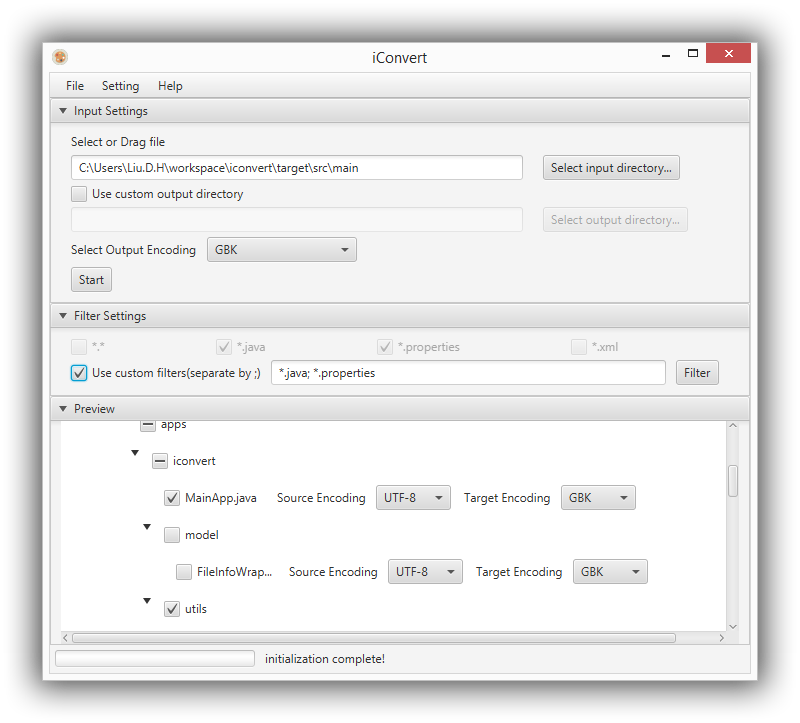

# iConvert #

### Introduction ###

This is a simple cross-platform small app for file encoding convertion. You can optional select a output directory or use the default convertion behavior which firstly baked up the root directory appending "_bak" then execute direct convertion on original files.

### Features ###

- nice and easy UI
- show file system structure
- auto detect source encoding
- batch select target encoding
- customize source encoding and target encoding
- support theme
- support i18n

### Dev Prerequisite ###

- eclipse-jee-luna or above
- jdk-8-update-40 or above 

### How to build ###

- import as maven project in eclipse
- do anything you want or need

### To do in future ###

- add UTF-8 with bom support
- fix some existed issues currently
- refact code to make more readable and high-performace

### Some snapshot ###
- The main window

### Copyright and license ###

Licensed under the Apache License, Version 2.0 (the "License"); you may not use this software except in compliance with the License.

Unless required by applicable law or agreed to in writing, software distributed under the License is distributed on an "AS IS" BASIS, WITHOUT WARRANTIES OR CONDITIONS OF ANY KIND, either express or implied. See the License for the specific language governing permissions and limitations under the License.